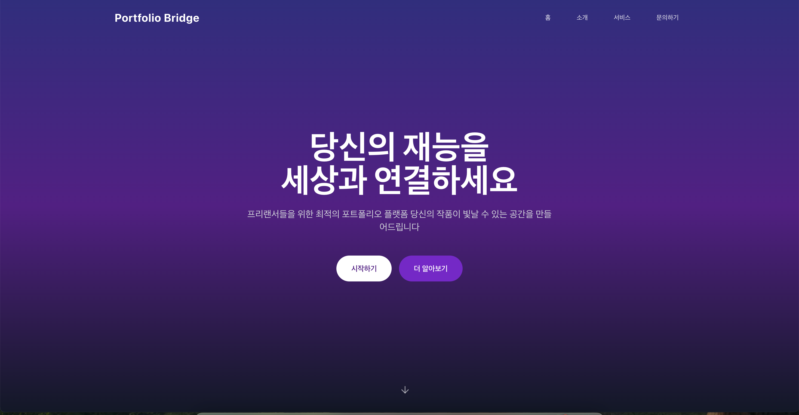

# FreelanceCycle 🚀

## 오픈소스 라이선스 📢

이 프로젝트는 프로토타입으로 제작되었으며, 누구나 자유롭게 활용하여 서비스를 개발하실 수 있습니다.
- 상업적 이용 가능
- 수정 및 배포 자유
- 원작자 표기 불필요

프리랜서 플랫폼의 발전을 위해 여러분의 아이디어를 자유롭게 접목하여 새로운 서비스를 만들어보세요!

  

## 프로젝트 소개 💡

FreelanceCycle은 프리랜서와 기업을 연결하는 혁신적인 포트폴리오 플랫폼입니다. 현대적인 UI/UX와 강력한 기능을 통해 프리랜서들이 자신의 작업물을 효과적으로 전시하고, 잠재 고객들과 쉽게 연결될 수 있도록 도와줍니다.

### 주요 기능 ⭐
- 포트폴리오 전시 및 관리
- 프로젝트 매칭 시스템
- 실시간 커뮤니케이션
- 프로필 관리
- 프로젝트 진행 현황 추적

## 기술 스택 🛠

### Frontend
- React
- Tailwind CSS
- Framer Motion
- React Router

### 디자인
- 모던하고 직관적인 UI
- 반응형 디자인
- 애플 스타일의 애니메이션

  
  
  

## 주요 페이지 📱

### 랜딩 페이지
- 직관적인 서비스 소개
- 주요 기능 하이라이트
- 사용자 친화적인 네비게이션

### 소개 페이지
- 애플스러운 스크롤 애니메이션
- 회사 가치 및 미션 소개
- 시각적으로 매력적인 디자인

### 서비스 페이지
- 포트폴리오 갤러리
- 카테고리별 프로젝트 분류
- 검색 및 필터링 기능

### 문의 페이지
- 고급스러운 문의 폼
- 기업 정보 표시
- 연락처 정보

## 현재 구현된 기능 ✅
- [x] 반응형 웹 디자인
- [x] 스크롤 기반 애니메이션
- [x] 페이지 라우팅
- [x] 기본 UI 컴포넌트
- [x] 문의하기 기능

## 향후 개발 계획 📋
- [ ] 사용자 인증 시스템
- [ ] 포트폴리오 업로드 기능
- [ ] 실시간 채팅
- [ ] 프로젝트 매칭 알고리즘
- [ ] 결제 시스템 연동

## 기여 방법 🤝

1. 이 저장소를 포크합니다
2. 새로운 브랜치를 생성합니다 (`git checkout -b feature/amazing-feature`)
3. 변경사항을 커밋합니다 (`git commit -m 'Add some amazing feature'`)
4. 브랜치에 푸시합니다 (`git push origin feature/amazing-feature`)
5. Pull Request를 생성합니다

## 연락처 📧

프로젝트 관리자 - [@YangMun](https://github.com/YangMun)

프로젝트 링크: [http://sensational-kangaroo-50b175.netlify.app](http://sensational-kangaroo-50b175.netlify.app)

---
